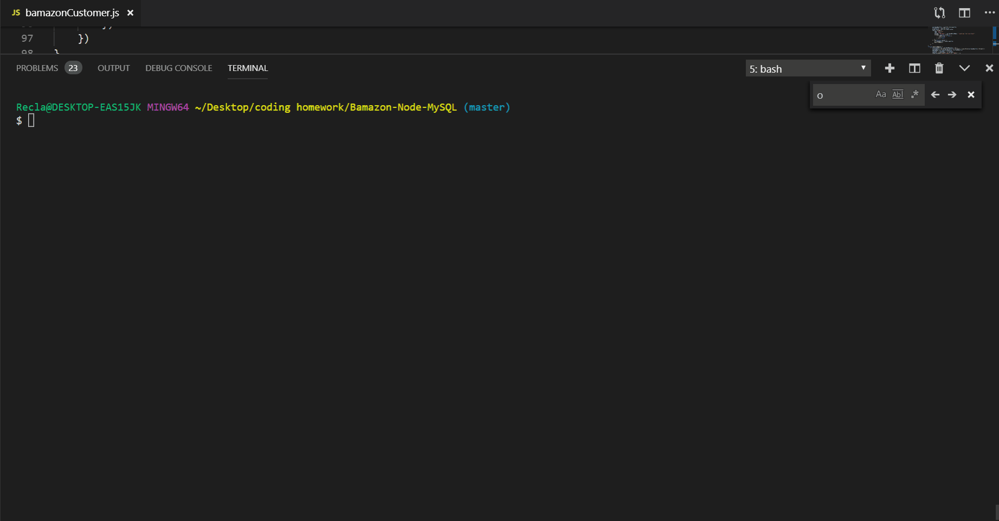
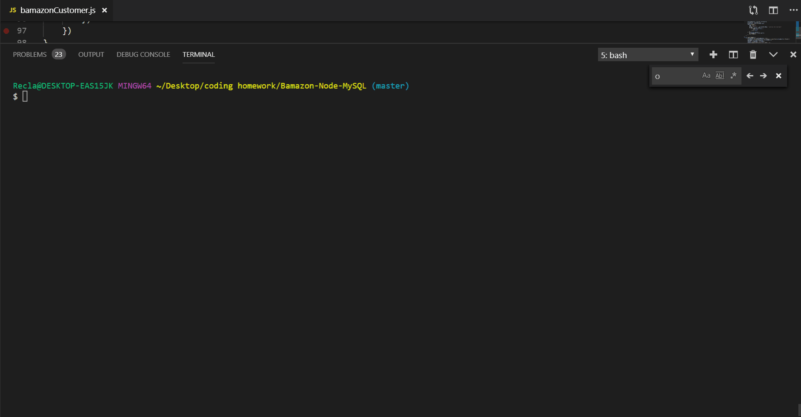

# Bamazon-Node-App

## How to Make it Functional:

1)  Open Bamazon database.sql in mysql.
2)  Run Bamazon database.sql.
3)  Open up a terminal in VSCode or your code program of choice.
4)  Enter node BamazonCustomer.js at the prompt.
5)  Buy the finest items from my store.

### This database will only function with a host name of localhost, a port of 3306, a user name root, and a password root.

## How to Make it Functional as a Manager:
1)  Open Bamazon database.sql in mysql.
2)  Run Bamazon database.sql.
3)  Open up a terminal in VSCode or your code program of choice.
4)  Enter node BamazonManager.js at the prompt.
5)  View and replenish the inventories of the finest items from my store.

## What does it do?

Pulls data from a mysql database, updates inventory real time, keeps track of what you're spending.

This project incorporates a few NPM packages including:  
    **1)** mysql, 
    **2)** inquirer,  
    **3)** table. 

## How to use it:

### To buy items:
    On the command line:  
        node BamazonCustomer.js
            follow prompts.
            
     

### To enter manager mode:
    On the command line:
        node BamazonManager.js
            follow prompts.

 
